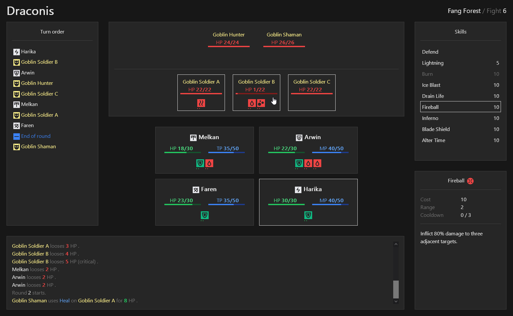

# Draconis

Early stages of a simple, web based, old school RPG.

Standard disclaimer: I'm mostly a backend guy, so as long as I'm the only one designing the UI,
don't expect pretty. Best I can do is basic.

This project is also a sandbox to keep working on frontend technologies such as:
Angular, TypeScript, Tailwind, CSS animations, SVG, etc.

A sample in-game screenshot:

## 1. Main design choices

The current design choices and objectives are:

- No install, but playable with a web browser
- Single player, no backend
- Not text based per se, but textual look and feel with some icons
- No world to explore but basic city hubs, dungeons and quests
- Party based with 4 characters of different classes
- Class specific active and passive skills
- Character classes use one of two type of energy point (tech vs mana) with different generation mechanisms
- Turn based and slightly tactical (i.e. party and enemies use rows) combats
- Generated loot
- Some crafting
- Misc (consumables such as potions, combat statuses, etc)

## 2. Systems

The major application systems and their progress are:

| System     | Description                                           | Progress |
|------------|-------------------------------------------------------|----------|
| Combat     | Turns, actions, targets, rows, outcomes, statuses     | 30 %     |
| Characters | Classes, skills, attributes, levels                   | 15 %     |
| Enemies    | Classes, skills, A.I.                                 | 15 %     |
| World      | Dungeons, cities, quests                              | 5 %      |
| Items      | Equipment slots, consumables, affixes, rarities, loot | 0 %      |
| Crafting   | Creation, alteration and upgrade of items             | 0 %      |

### 2.1 Combat system

Features of the combat system:

- [x] Group based, i.e. multiple characters vs multiple enemies
- [x] Turn based
- [x] Turn order is randomly generated for each fight and evenly interleaves characters and enemies
- [x] Row based, i.e. a group has two rows, the front row or back row
- [x] Some creatures (e.g. bosses) can have multiple actions per turn
- [x] Skill ranges, i.e. melee attacks can only reach front row opponents while distance attacks can reach any opponent
- [x] Single target skills and area of effect skills
- [x] Damaging skills and healing skills
- [x] Basic damage computation
- [x] Hit time damage and heals and over time damage and heals
- [x] Bonus effects (a.k.a buffs) and malus effects (a.k.a debuffs)
- [x] State enabled skills (e.g. damage is also based on creatures life)
- [x] Several skill outcomes (success, dodge, critical)
- [x] Skill modifiers, e.g. cannot be dodged 
- [x] Counter-attacks and/or thorns
- [x] Skills cooldown
- [x] Multiple effect skills, e.g. a damage and an effect
- [x] Chained attacks, i.e. consecutively using  the same attack changes its result
- [x] Specialties, i.e. per class benefits against specific creature types (such as beasts, undeads, etc)
- [x] Creature size (small, regular, large, etc) to control the maximum number of enemies per row
- [x] Champions support, i.e. some randomly selected creatures are stronger
- [x] Several enemy strategies: single skill, message, priority, sequential, weighted, conditional

Not yet implemented:
- [ ] Advanced damage computation using armor, elemental resistances, etc
- [ ] Crowd controls (e.g. stun, silence, etc)
- [ ] Multiple element damages, e.g. physical damage plus poison damage
- [ ] Taunts
- [ ] Interceptions, e.g. intercept the next attack that would kill an allied creature
- [ ] Other features
